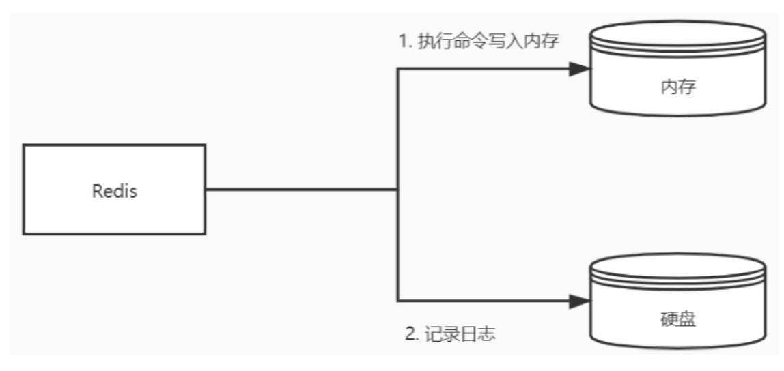
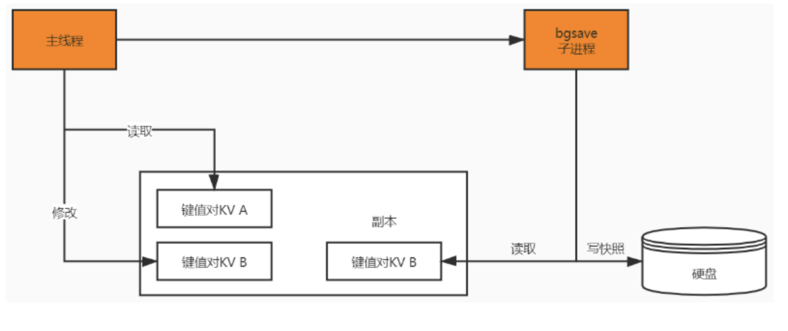
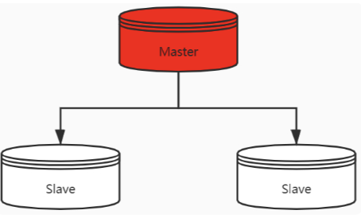

# Redis是单线程还是多线程？

redis不同版本之间采用的线程模式是不一样的，在redis4.0版本之前使用的是单线程模式，在4.0版本之后增加了多线程的支持。
在4.0之前虽然我们说redis是单线程，也只是说它的网络I/O线程以及Set和Get操作是由一个线程完成的。但是Redis的持久化、集群同步还是 使用其他线程完成。
4.0之后添加了多线程的支持，主要是体现在大数据的异步删除功能上，例如`unlink`、`flushdb async`、`flushall async`等。

# 为什么Redis在4.0之前会选择使用单线程？而且使用单线程还那么快？

选择使用单线程，主要是使用简单，不存在锁竞争，可以在无锁的情况下完成所有操作，不存在死锁和线程切换带来的性能和时间上的开销，但同时单线程也不能完全发挥出多核CPU的性能。
为什么单线程那么快，主要有以下几个原因：
1. Redis的大部分操作都在内存中完成，内存中的执行效率本身就很快，并且采用了高效的数据结构，比如哈希表和跳表。
2. 使用了单线程避免了多线程竞争，省去了多线程切换带来的时间和性能开销，并且不会出现死锁。
3. 采用I/O多路复用机制处理大量客户端的Socket请求，因为这是基于非柱塞的I/O模型，这就让Redis可以高效的进行网络通讯，I/O的读写流程也不用柱塞。

# Redis是如何实现数据不丢失？

Redis数据是储存在内存中的，为了保证Redis数据不丢失，那就要把数据从内存储存到磁盘上，以便在服务器重启后还能够从磁盘中恢复原有数据，这就是Redis的数据持久化。Redis持久化有三种方式。
- AOF日志（Append Only File，文件追加方式）：记录所有的操作命令，并以文本形式追加到文件中。
- RDB快照（Redis DataBase）：将某一个时刻的内存数据，以二进制的方式写入磁盘。
- 混合持久化方式：Redis4.0新增了混合持久化的方式，集成了RDB和AOF的优点。

# AOF和RDB的实现原理？

1. AOF采用的是写后日志的方式，Redis先执行命令把数据写入内存，然后再记录日志到文件中。AOF日志记录的是操作命令，不是实际的数据，如果采用AOF方法做故障恢复时需要将全量日志都执行一遍。

2. RDB采用的是内存快照的方式，它记录的是某一时刻的数据，而不是操作，所以采用RDB方法做故障恢复时只需要直接把RDB文件读入内存即可，实现快速恢复。

# AOF采用的是“写后日志”方式，我们平时用的MySQL则采用的是“写前日志”，那Redis为什么要先执行命令，再把数据写入日志呢？

这个主要是由于Redis在写入日志之前，不对命令进行语法检查，所以只记录执行成功命令，避免出现记录错误命令的情况，而且在命令执行后再写日志不会阻塞当前写操作。

写后日志有什么风险：
- 数据可能会丢失：如果Redis刚执行完成命令，此时发生故障宕机，会导致这条命令存在丢失的风险。
- 可能阻塞其他操作：AOF日志其实也是在主线程中执行，所以当Redis把日志文件写入磁盘的时候，还是会阻塞后续的操作无法执行。

# RDB做快照时会阻塞线程吗？

Redis提供了两个命令来生成RDB快照文件，分别是`save`和`bgsave`。`save`命令在主线程中执行，会导致阻塞。而`bgsave`命令则会创建一个子进程，用于写入RDB文件的操作，避免了对主线程的阻塞，这也是Redis RDB默认配置。

# RDB做快照的时候数据能修改吗？

save是同步的会阻塞客户端命令，bgsave的时候是可以修改的。

# 那Redis是怎么解决在bgsave做快照的时候允许数据修改呢？

这里主要是利用`bgsave`的子线程实现的，具体操作如下：
- 如果主线程执行读操作，则主线程和`bgsave`子进程互不影响。
- 如果主线程执行写操作，则被修改的数据会复制一份副本，然后`bgsave子进程会把该副本数据写入RDB文件，在这个过程中，主线程仍然可以直接修改原来的数据。

要注意，Redis对RDB的执行频率非常重要，因为这会影响快照数据的完整性以及Redis的稳定性，所以在Redis4.0后，增加了AOF和RDB混合的数据持久化机制：把数据以RDB的方式写入文件，再将后续的操作命令以AOF的格式存入文件，既保证了Redis重启速度，又降低数据丢失风险。

# redis如何实现高可用？

Redis实现高可用主要有三种方式：主从复制、哨兵模式、以及Redis集群

## 1.主从复制
将一台Redis服务器，同步数据到多台从Redis服务器上，即一主多从的模式，这个跟MySQL主从复制的原理一样。

## 2.哨兵模式
使用Redis主从服务的时候，会有一个问题，就是当Redis的主服务器宕机时候，需要手动进行恢复，为了解决这个问题，Redis增加了哨兵模式（因为哨兵做到了可以监控主从服务器，并且提供了自动容灾难恢复功能）。

## 3.Redis集群
Redis Cluster是一种分布式去中心化的运行模式，实在Redis3.0版本中推出的Redis集群方案，它将数据分布在不同的服务器上，以此来降低系统对单节点的依赖，从而提高Redis服务读写性能。

# 使用哨兵模式在数据上有副本数据做保证，在可用性上又有哨兵监控，一旦master宕机会选举salve节点为master节点，这种已经满足了我们生成环境需要，那为什么还要使用集群模式呢？

哨兵模式归根还是主从复制模式，在主从模式下我们可以通过增加salve节点来扩展读并发能力，储存能力只能是master节点能够承载的上限。所以为了扩展写能力和储存能力，我们就需要引入集群模式。

# 集群中那么多Master节点，redis cluster在储存的时候如何确定选择那个节点呢？

Redis Cluster采用的是类一直性哈希算法实现节点选择的。
Redis Cluster将自己分成了16384个slot（槽位），哈希槽类似于数据分区，每个键值对都会根据它的key，被映射到一个哈希槽中，具体执行过程分为两大步骤。
- 根据键值对的key，按照CRC16算法计算一个16bit的值。
- 再用16bit值对16384取模，的到`0-16384`范围内模数，每个模数代表一个相应编号的哈希槽。

每个Redis节点负责处理一部分槽位，假如有三个master节点ABC，每个节点负责的槽位如下。

